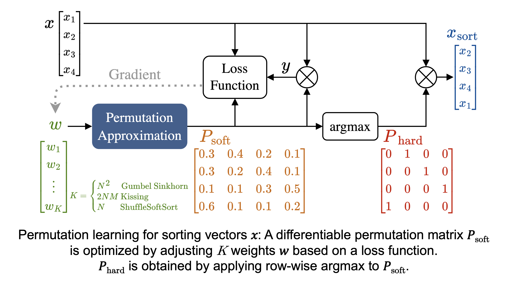
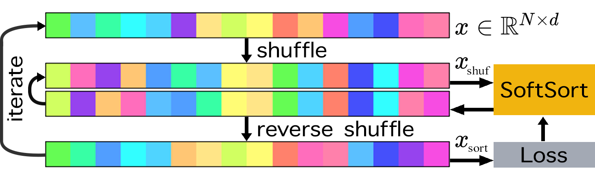
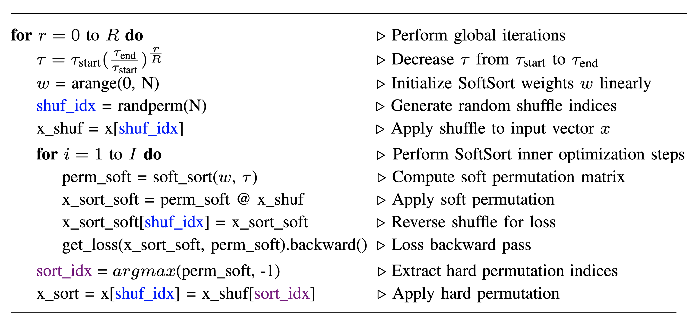
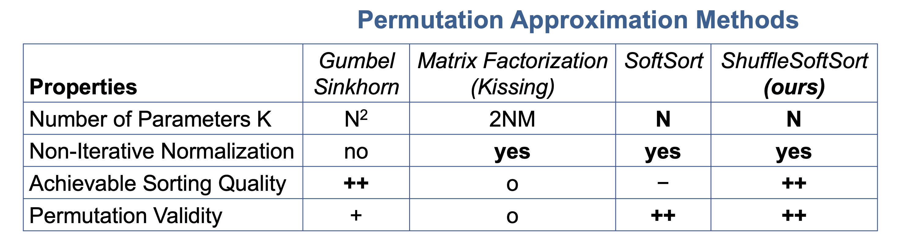

# ShuffleSoftSort - Permutation Learning with Only N Parameters

**Kai Uwe Barthel (1), Florian Barthel (2), Peter Eisert (2)**
1: HTW Berlin, Germany, 2: Fraunhofer HHI / HU Berlin, Germany

## 🚀 A Scalable Approach to Permutation Learning

Existing methods for **permutation learning**, such as Gumbel-Sinkhorn, are **computationally expensive**, scaling with $O(N^2)$ parameters, making them impractical for large datasets. While low-rank approximations offer some relief, they do not fully solve the scalability issue.

Furthermore, state-of-the-art differentiable sorting techniques like **SoftSort** are limited to one-dimensional data and fail when applied to complex, **multidimensional data** structures.

This paper introduces **ShufflSoftSort**, a novel permutation learning method that achieves **significantly improved scalability** and sorting quality.

* **Efficiency:** It requires only **$O(N)$ parameters**, a dramatic reduction from prior $O(N^2)$ methods.
* **Approach:** It works by **iteratively applying SoftSort** in a strategic manner to handle multidimensional inputs effectively.

This makes the method **ideal for large-scale tasks** requiring efficient permutation learning, such as the *Self-Organizing Gaussians* application.

### Principle

In the following ShuffleSoftSort toy example, colors are sorted in 1D. The loss is calculated on the reverse-shuffled output, which helps to refine the permutation and to overcome the limitations of SoftSort.

### Algorithm

### Properties

### Example Implementation
Example Pytorch notebooks can be found [here](https://github.com/Visual-Computing/ShuffleSoftSort/tree/main/python).

### Release

- [2025/09/11]  [Permutation Learning with Only N Parameters: From SoftSort to Self-Organizing Gaussians](https://eurasip.org/Proceedings/Eusipco/Eusipco2025/pdfs/0001892.pdf).

